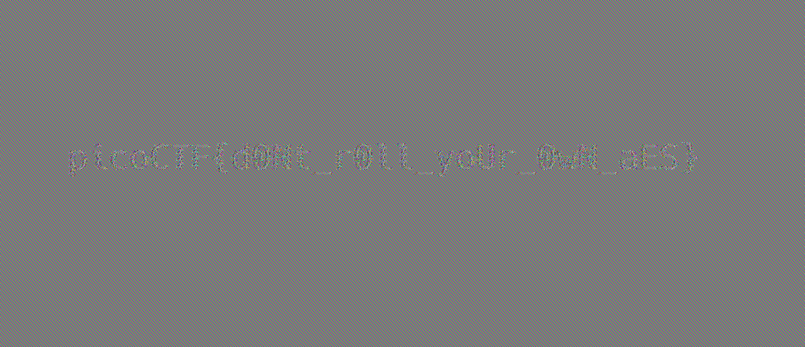

# AES-ABC
`ECB` is realy bad, as the same block will always be encrypted the same way. In images, this manifests itself in the image still being recognisable.

Therefor if we just undo the ABC, we should be able to squint hard enought to see the origional.


This is helped by the fact in the origional image, much of the outside looks sililar. Therefor we can guess this will be a background, whereas the more chaotic bit in the midddle will have the flag.

Now we can look more closely at the encryption
```python
def aes_abc_encrypt(pt):
    cipher = AES.new(KEY, AES.MODE_ECB)
    ct = cipher.encrypt(pad(pt))

    blocks = [ct[i * BLOCK_SIZE:(i+1) * BLOCK_SIZE] for i in range(len(ct) / BLOCK_SIZE)]
    iv = os.urandom(16)
    blocks.insert(0, iv)
    
    for i in range(len(blocks) - 1):
        prev_blk = int(blocks[i].encode('hex'), 16)
        curr_blk = int(blocks[i+1].encode('hex'), 16)

        n_curr_blk = (prev_blk + curr_blk) % UMAX
        blocks[i+1] = to_bytes(n_curr_blk)

    ct_abc = "".join(blocks)
 
    return iv, ct_abc, ct
```
Looking at this we can say that
```
abc[0] = iv
abc[n+1] = ebc[n] + abc[n] % UMAX
```
The secound can be rewritten as
```
ebc[n] + abc[n] = k*UMAX + abc[n+1]
```
where k is a non-negative integer. Therefor
```
ebc[n] = abc[n+1] - abc[n] + k*UMAX
```

Because `UMAX` must fit within a block, so it must be greater than  `ebc[n]` and `abc[n+1]`. Therefor the range of `abc[n+1] - abc[n]` is less than `UMAX` so their can only be one value 
of `k` that makes `ebc[n]` in a valid range

Therefor we can trivialy find k and undo the ABC layer
```python
import math
BLOCK_SIZE = 16
UMAX = int(math.pow(256, BLOCK_SIZE))
def to_bytes(n):
    s = hex(n)
    s_n = s[2:]
    if 'L' in s_n:
        s_n = s_n.replace('L', '')
    if len(s_n) % 2 != 0:
        s_n = '0' + s_n
    decoded = s_n.decode('hex')
    pad = (len(decoded) % BLOCK_SIZE)
    if pad != 0: 
        decoded = "\0" * (BLOCK_SIZE - pad) + decoded
    return decoded

def remove_line(s):
    return s[:s.index('\n') + 1], s[s.index('\n')+1:]

def parse_header_ppm(f):
    data = f.read()
    header = ""
    for i in range(3):
        header_i, data = remove_line(data)
        header += header_i
    return header, data

with open('body.enc.ppm', 'rb') as cf:
    hed, dat = parse_header_ppm(cf)

cb = [dat[i * BLOCK_SIZE:(i+1) * BLOCK_SIZE] for i in range(len(dat) / BLOCK_SIZE)]
mb = []
for i in range(len(cb) - 1):
    abc_n = int(cb[i].encode('hex'), 16)
    abc_n_plus_1 = int(cb[i+1].encode('hex'), 16)
    delta = abc_n_plus_1 - abc_n
    while delta < 0:
        delta += UMAX
    mb.append(to_bytes(delta))

with open('flag.ppm', 'wb') as mf:
    mf.write(hed)
    mf.write("".join(mb))
```
Some notes:
 - We use python2, because I the pico code is written in it, and I want to reuse their code
 - We reuse some code from the encryption 

This will output a new `ppm` image, which has the flag



flag: `picoCTF{d0Nt_r0ll_yoUr_0wN_aES}`
