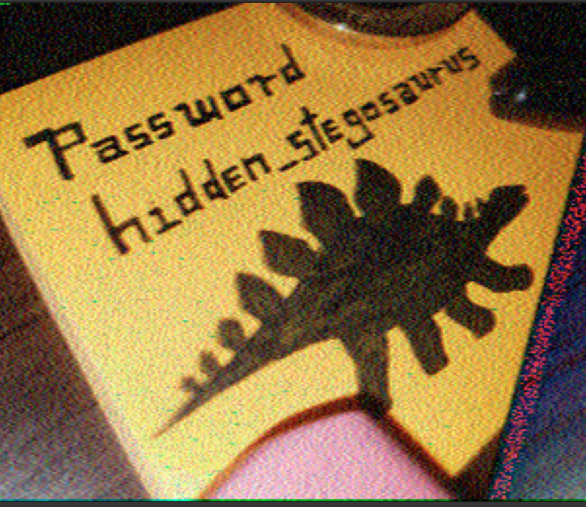
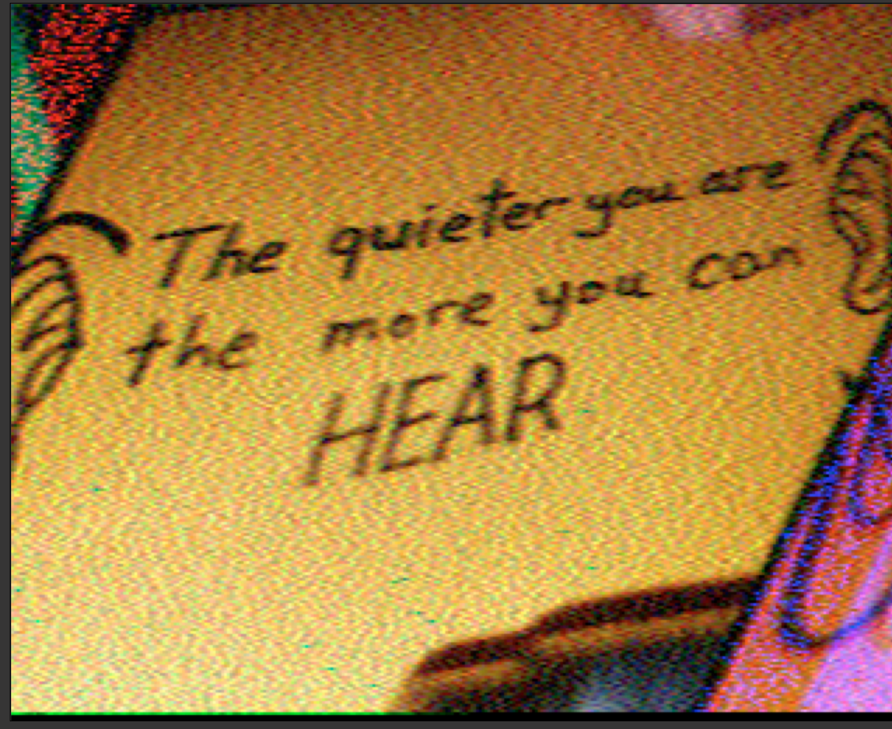
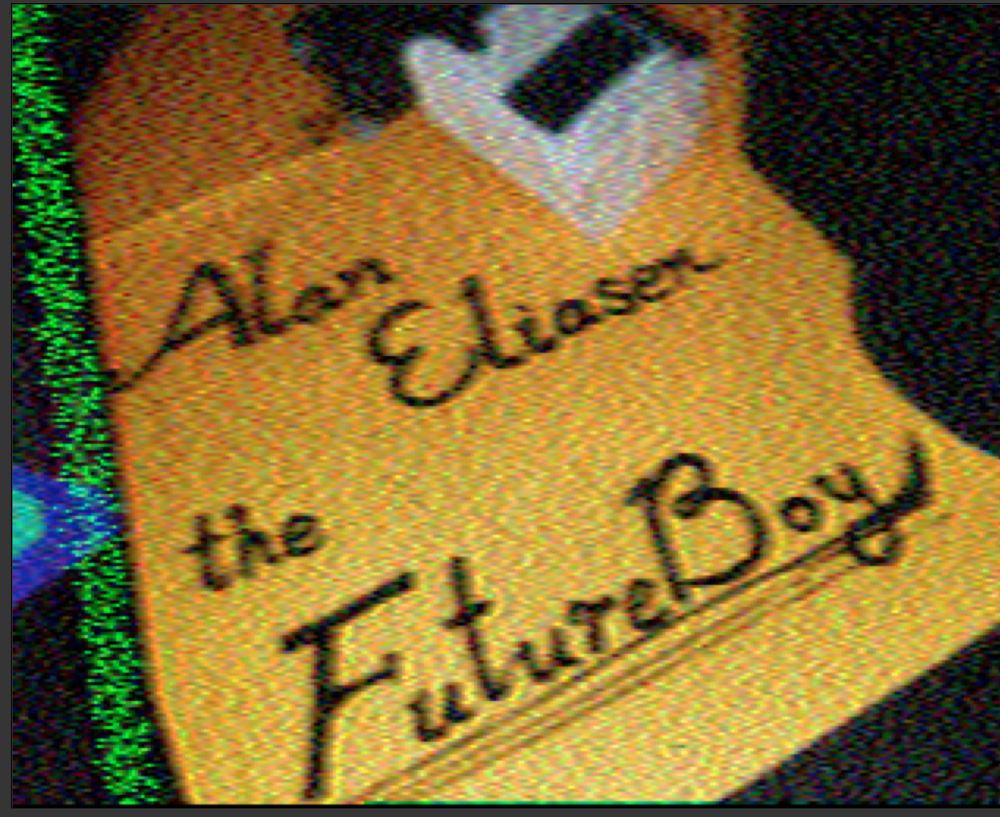

# m00nwalk2
Run blackcat sstv on the three clues gives three img.

Googling [Alan Eliasen the FutureBoy](https://www.google.com/search?client=firefox-b-d&q=Alan+Eliasen+the+FutureBoy) we get [this website](https://futureboy.us/). A bit of navigating gets the [Steganographic Decoder](https://futureboy.us/stegano/decinput.html).

Using message.wav and password `hidden_stegosaurus` we get (very slowly) `picoCTF{the_answer_lies_hidden_in_plain_sight}`

flag: `picoCTF{the_answer_lies_hidden_in_plain_sight}`