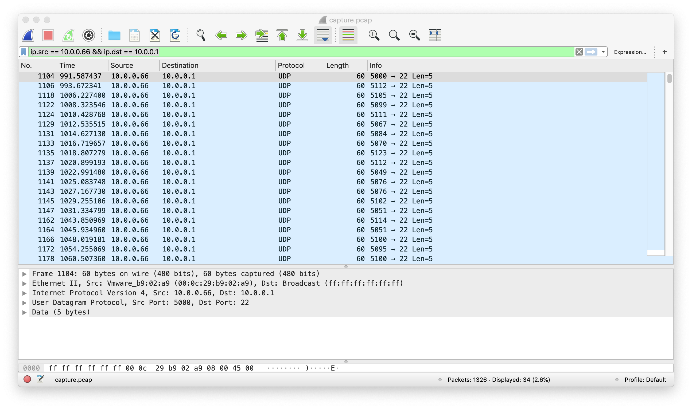

# shark on wire 2
Opening up the trafic in wireshark, we can see it's alot. 
After a bit of poking we can see some funky trafic between 
10.0.0.66 and 10.0.0.1. Now we can use the filter `ip.src == 10.0.0.66 && ip.dst == 10.0.0.1` to get just these packets.

It looks like the source port is 5000 + some ascii value. By exporting just these packets to `interesting.pcap` we can use [`scapy`](https://scapy.net/) to get the answer
```python
from scapy.all import rdpcap
cap = rdpcap('./interesting.pcap')
flag = ''
for i in cap:
    flag +=chr(i.sport-5000)

print(flag)
```
flag: `picoCTF{p1LLf3r3d_data_v1a_st3g0}`