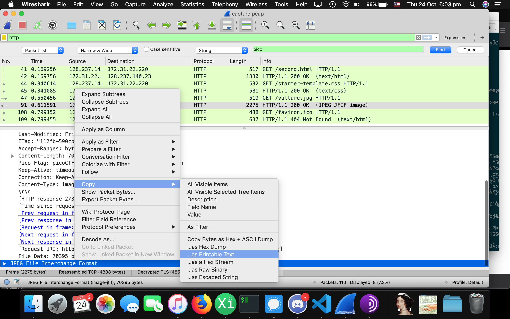

# WebNet1
They keys are the same so we can use the old one.
```bash
$md5sum ../*/*.key
57a3d0809b40857e71cbe069cda58829  ../15-webnet0/picopico.key
57a3d0809b40857e71cbe069cda58829  ../17-webnet1/picopico.key
```
Therefor we can open it up in wireshark and use the same sweet automatic decryption.

The flag is in `vulture.jpg`. To copy it select the packet with the jpeg and copy as text. 


To get the flag from the image use (on mac)
```bash
pbpaste | grep pico
```
or 
```bash
xclip -out -selection clipboard | grep pico
```
flag: `picoCTF{honey.roasted.peanuts}`

