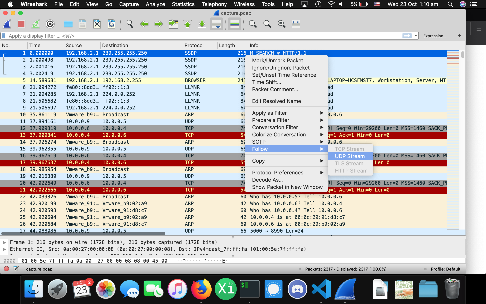
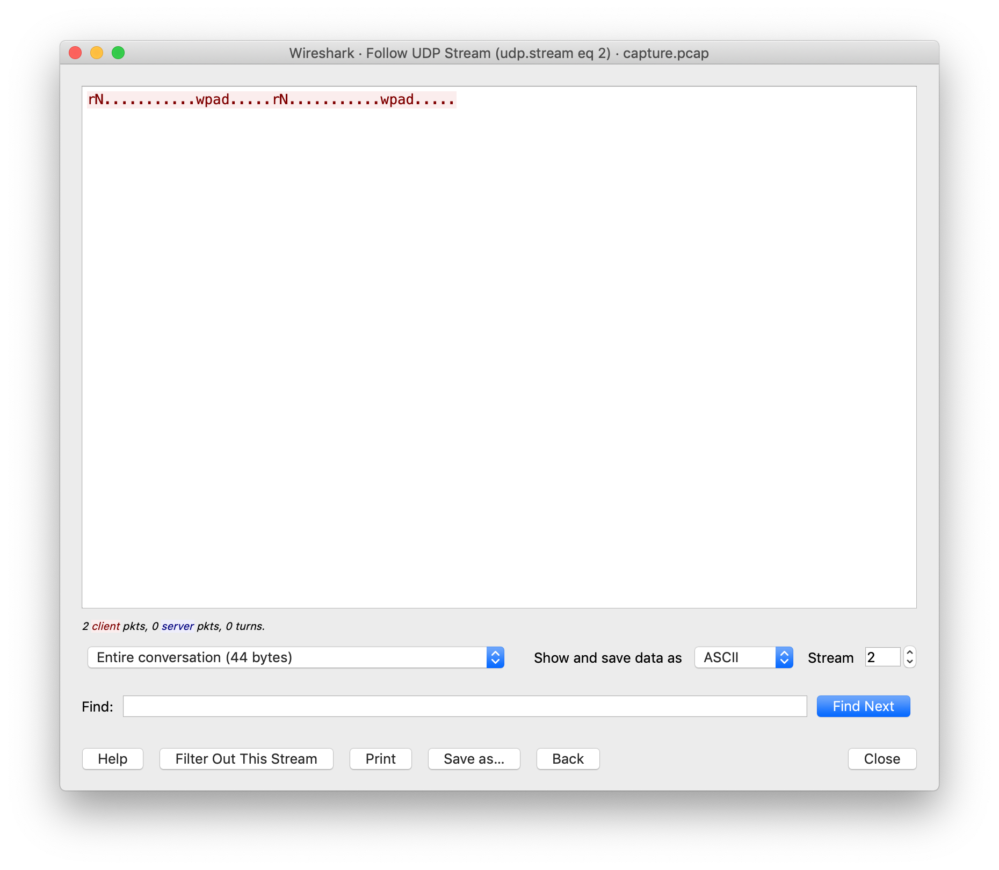
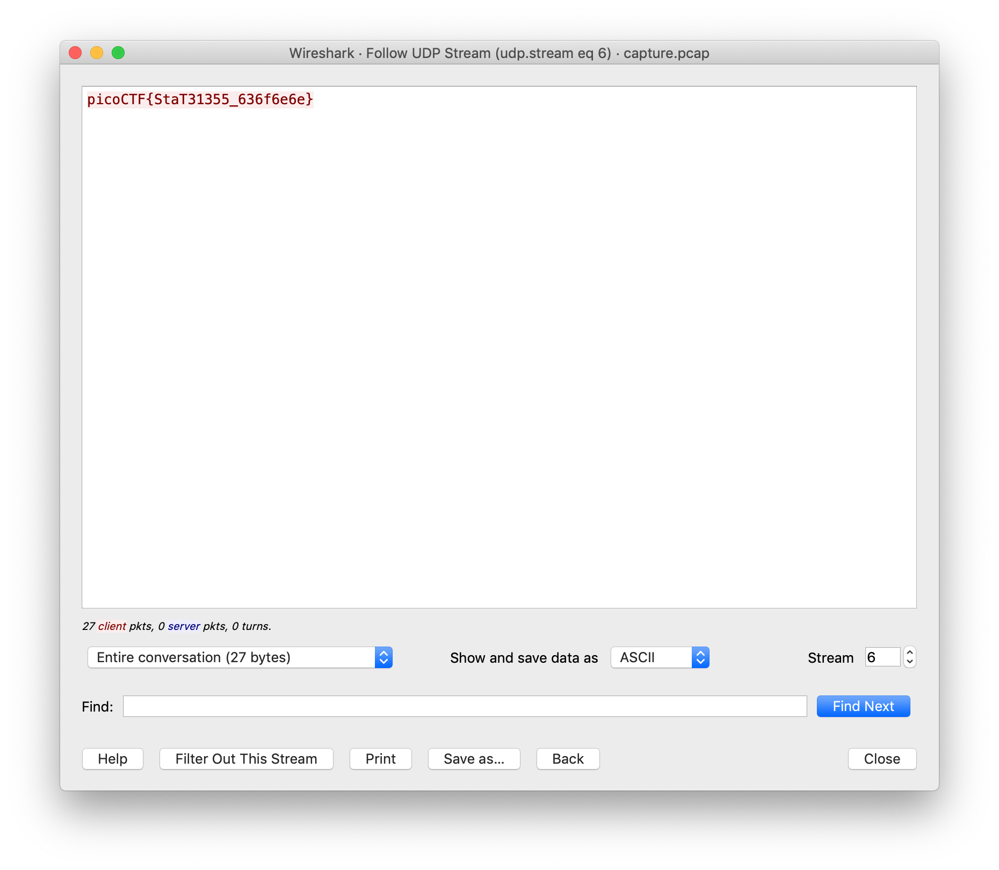

# shark on wire 1
Opening up the `.pcap` in [wireshark](https://www.wireshark.org/), it's alot.
However the hint sujested streams, so we'll look at those.

First click on a packet and select follow udp stream

This shows the contenst of that stream

Flick throught the streams to find the right one

flag: `picoCTF{StaT31355_636f6e6e}`