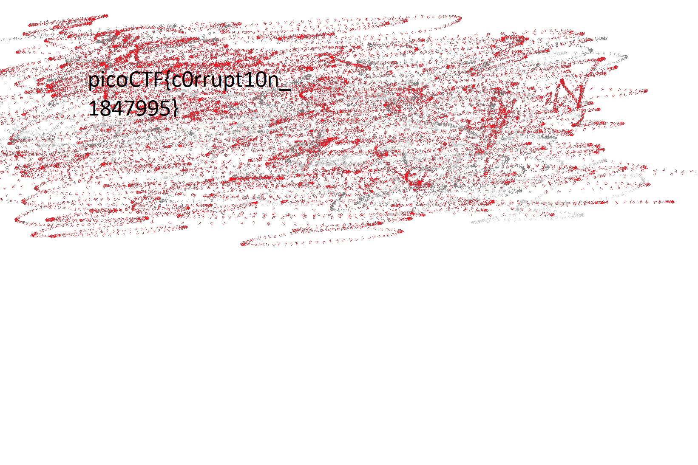

# c0rrupt
Viewing the file in `xxd` we can guess that is's a png. Therefor you probably
want to have [`pngcheck`](http://www.libpng.org/pub/png/apps/pngcheck.html) installed.

However `pngcheck` doesn't even know that it's a png, because the [magic number](https://en.wikipedia.org/wiki/List_of_file_signatures) is wrong. We can use `hexedit` to replace `8965 4e34 0d0a b0aa` with `8950 4E47 0D0A 1A0A`. Saving this as `mag_num.png`, we now hope that that was all.
```bash
$pngcheck mag_num.png 
mag_num.png:  invalid chunk name "C"DR" (43 22 44 52)
ERROR: mag_num.png
```
At this point, its probably worth reading [Information technology — Computer graphics and image processing — Portable Network Graphics (PNG): Functional specification. ISO/IEC 15948:2003 (E)
W3C Recommendation 10 November 2003](https://www.w3.org/TR/PNG/), or the PNG specification.

The important part is [section 5: Datastream structure](https://www.w3.org/TR/PNG/#5DataRep), and in paticualar the [chunk ordering table](https://www.w3.org/TR/PNG/#5ChunkOrdering). 

We can tell from this that the chunk named `C"DR` must be named `IHDR`. Fixing this in hexedit gives the file `CDR2IHDR.png`
```shell
CDR2IHDR.png  CRC error in chunk pHYs (computed 38d82c82, expected 495224f0)
ERROR: CDR2IHDR.png
```
The checksum is wrong. At this point, you can replace `495224f0` with `38d82c82`. Saving this as `CRC_fix.png`, we still get an error.
```bash
$pngcheck CRC_fix.png 
CRC_fix.png  invalid chunk length (too large)
ERROR: CRC_fix.png
```
At this point look at the diagram for a chunk format

Going throuh each chunk we see that `IHDR` has lenght `0000 000d`. `sRGB` has lenght `00 0000 01`. `gAMA` has lenght `0000 0004`. `pHYs` has lenght `0000 0009`.

However the next chunk has name `ab 44 45 54`. This is similar to `49 44 41 54`, or `IDAT`, which does fit the [chunk ordering rules](https://www.w3.org/TR/PNG/#5ChunkOrdering). The problem is it's lenght is given as `aa aaff a5` or way to big.

To calcuate the real lenght find the next chunk, most likely `IDAT`. Their is one at offset `00010008` The first `IDAT` has ofsett `00000057`. This gives a difference of `FFB1`. Subtracting 4 bytes for the secound lenght field, 4 bytes for the first CRC and 4 bytes for the first IDAT chunktype we get a lenght of `0000FFA5`

Now fixing the name to `IDAT` and the length to `0000FFA5`, we get `IDAT_len.png`
```bash
$pngcheck IDAT_len.png 
OK: IDAT_len.png (1642x1095, 24-bit RGB, non-interlaced, 96.3%).
```
The file has the flag

flag: `picoCTF{c0rrupt10n_1847995}`