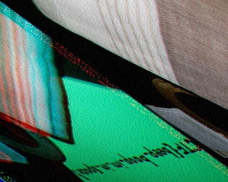
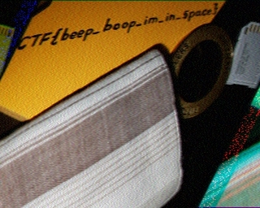

# m00nwalk
The message is encoded with [SSTV](https://en.wikipedia.org/wiki/Slow-scan_television), which was used in [early space exploration](https://en.wikipedia.org/wiki/Slow-scan_television#Early_usage_in_space_exploration).

To decode the messages, use [this app](https://www.blackcatsystems.com/software/sstv.html)

Opening it gives

Then adjusting skew and offset we get

Rotate to get

flag: `picoCTF{beep_boop_im_in_space}`