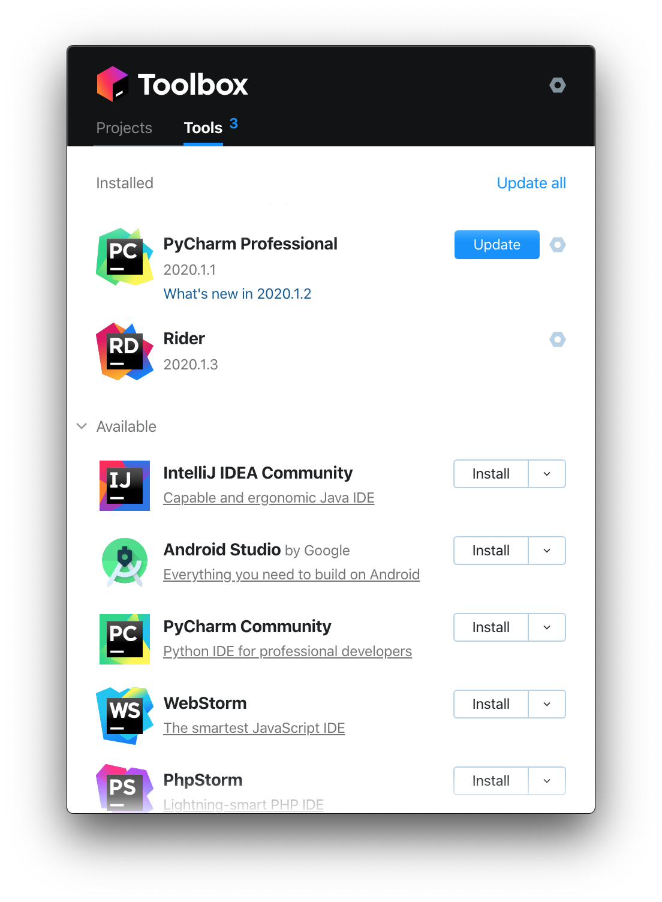
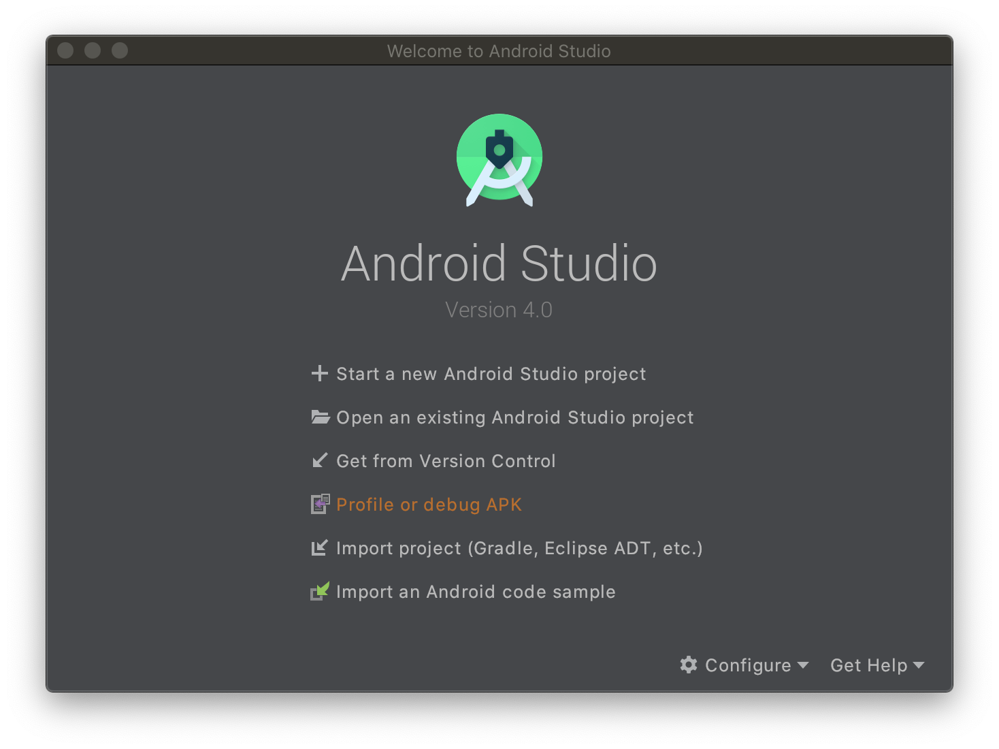
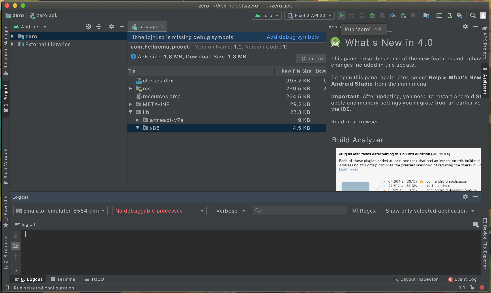
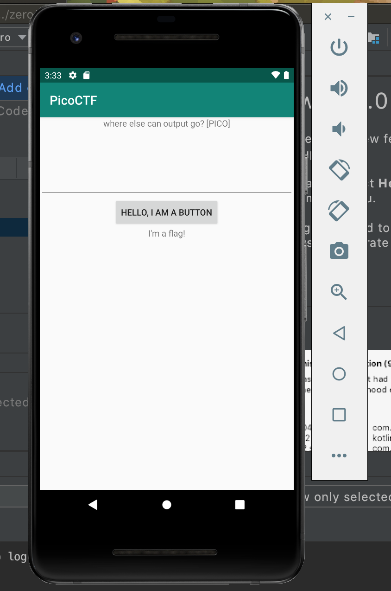
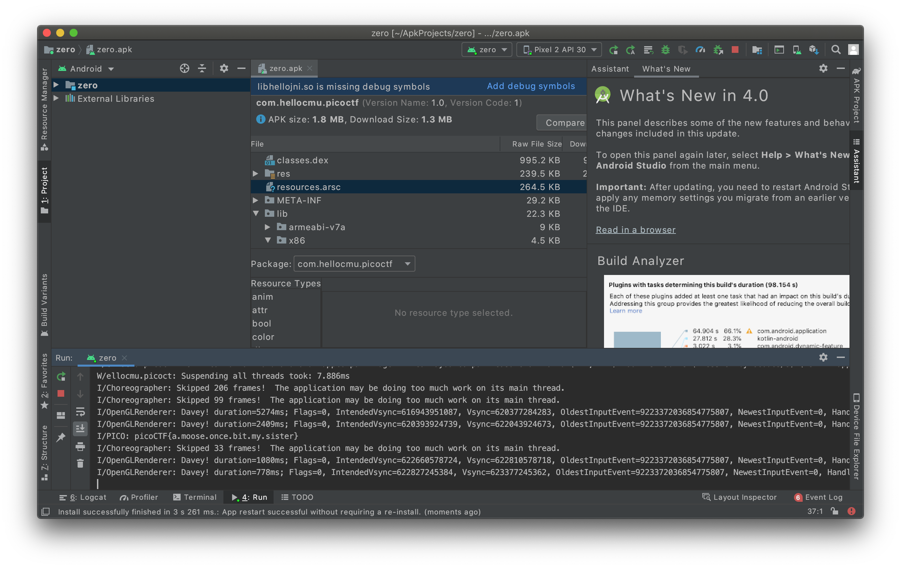

# droids0

First you need to install [android studio](https://developer.android.com/studio). I find the best way is to use [jetbrains toolbox](https://www.jetbrains.com/toolbox-app/).

Then open the apk.

You'll need to finagle android studio into having a virual device, but their are other better guides to do that. Once you have, press the green arrow in the top right

Then press the button in the app

And the flag is printed to the run section

Flag: `picoCTF{a.moose.once.bit.my.sister}`
