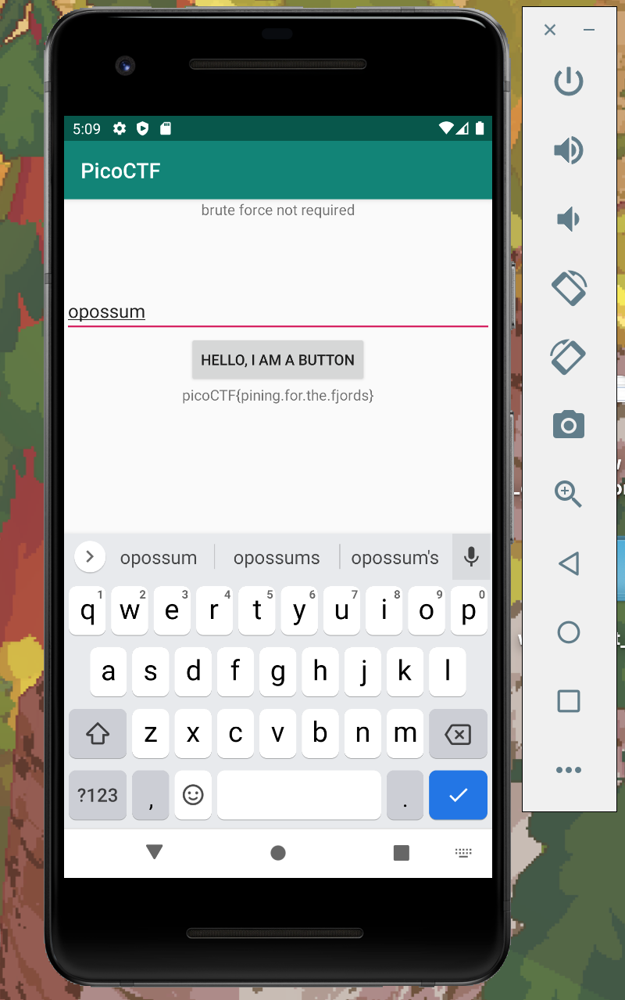

# droids1

We will use [jadx](https://github.com/skylot/jadx) to decompile the apk

```
jadx one.apk -d one
```

In `one/sources/com/hellocmu/picoctf/MainActivity.java` we see

```java
    public void buttonClick(View view) {
        this.text_bottom.setText(
            FlagstaffHill.getFlag(
                this.text_input.getText().toString(),
                this.ctx));
    }
```

Finding the `FlagstaffHill` class we see:
```java
    public static String getFlag(String input, Context ctx) {
        if (input.equals(ctx.getString(R.string.password))) {
            return fenugreek(input);
        }
        return "NOPE";
    }
```

`fenugreek` is a jni call that (presumably) produces the flag.

The password is comewhere in the context, and if we do `rg password one`, we get

```
one/sources/com/hellocmu/picoctf/FlagstaffHill.java
9:        if (input.equals(ctx.getString(R.string.password))) {

one/sources/com/hellocmu/picoctf/R.java
928:        public static final int password = 2131427375;

one/resources/res/values/strings.xml
50:    <string name="password">opossum</string>

one/resources/res/values/public.xml
893:    <public type="string" name="password" id="2131427375" />
```

It looks like the password is `opossum`



Entering that in, we get the flag.

Flag: `picoCTF{pining.for.the.fjords}`

