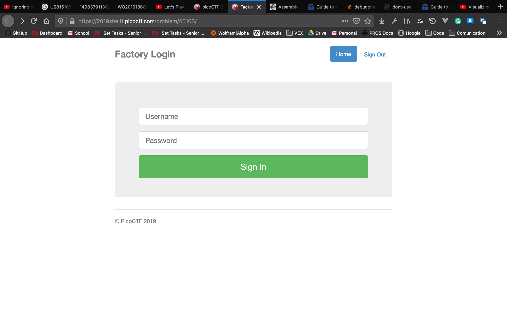
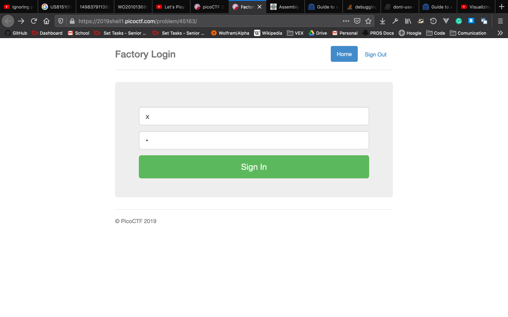
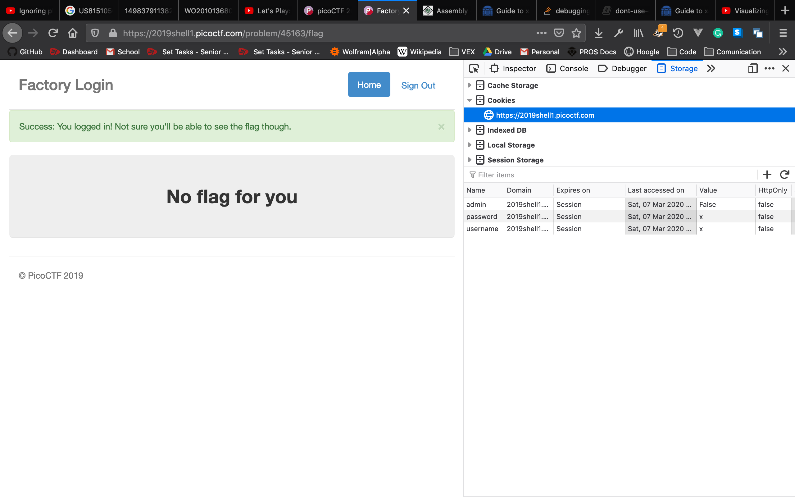
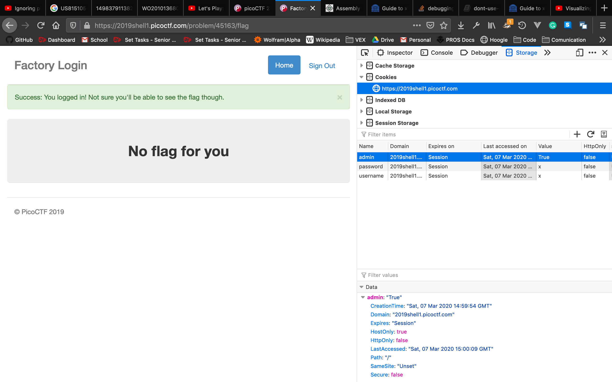
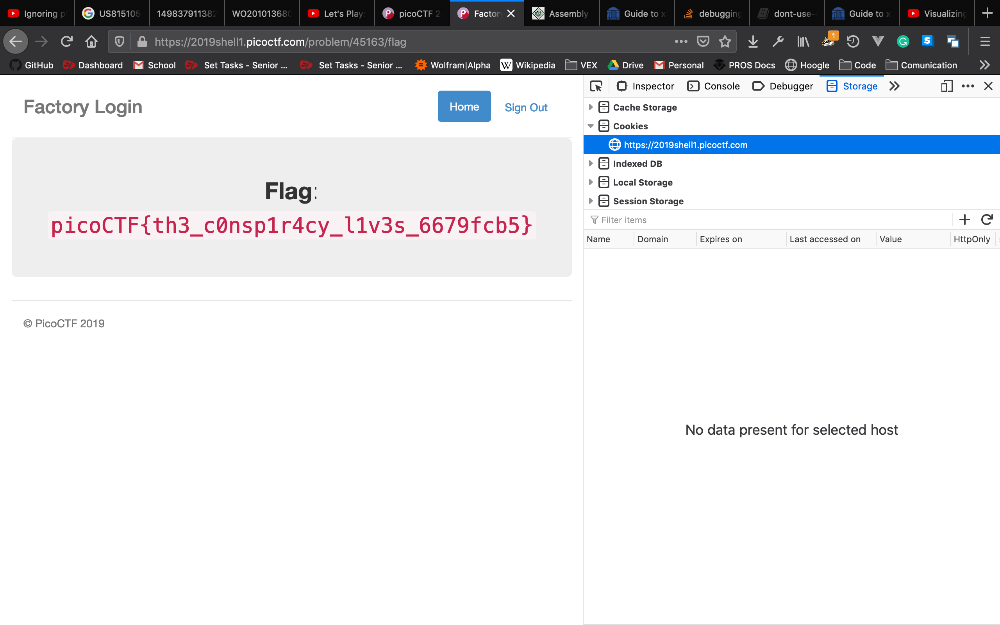

# logon
Opening the link we are given a login page

We can try any login

This let's us log in, but gives no flag. 

Looking at cookies, we aren't admin. Let's fix that

Once we change the cookie to true, we can just refresh the page

Flag: `picoCTF{th3_c0nsp1r4cy_l1v3s_6679fcb5}`